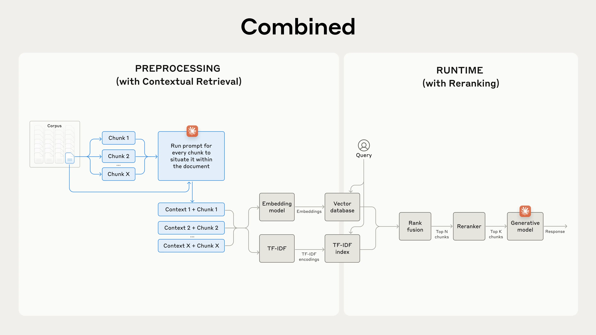

# Video Q&A Service - RAG System

Production-ready RAG (Retrieval-Augmented Generation) system for video lecture Q&A with hybrid search, reranking, and answer generation.

> **Status**: Currently undergoing refactoring from MVP to production-ready service. See [docs/PLAN.md](docs/PLAN.md) for the complete refactoring plan.

## 🚀 Quick Links

- [System Architecture](#system-architecture)
- [Installation & Setup](#installation--setup)
- [API Service](#api-service)
- [Development Roadmap](docs/PLAN.md)

---

## System Architecture

This project implements a modular RAG system for video lecture Q&A with hybrid retrieval.

Inspiration comes from (this)[https://www.anthropic.com/engineering/contextual-retrieval]:



Any updates should respect this original design.

### Current Architecture (MVP)

```
User Query
    ↓
Query Engine
    ↓
[Embedding] → Parallel Retrieval
    ├─→ Vector Search (Pinecone)
    └─→ Keyword Search (BM25)
    ↓
RRF Fusion
    ↓
Cross-Encoder Reranking
    ↓
LLM Generation (Gemini)
    ↓
Answer + Citations
```

### Key Components

- **Embedding**: Multi-model embedder (BGE-M3, Vietnamese, ME5)
- **Vector DB**: Pinecone for scalable vector search
- **BM25**: Local sparse retrieval index
- **Query Engine**: Orchestrates retrieval, fusion (RRF), reranking, and generation
- **Reranker**: Cross-encoder (`cross-encoder/ms-marco-MiniLM-L-12-v2`)
- **Generator**: Gemini 1.5 Pro via Vertex AI

### Target Architecture

See [docs/PLAN.md](docs/PLAN.md) for the complete production architecture plan.

---

## Installation & Setup

### Prerequisites

- Python 3.8+ (3.10+ recommended)
- Google Cloud Project with Vertex AI enabled (for Gemini)
- Pinecone account (for vector database)

### Environment Setup

1. **Create Virtual Environment**

   ```bash
   python -m venv .venv
   source .venv/bin/activate  # or .venv\Scripts\activate on Windows
   pip install -r requirements.txt
   ```

2. **Environment Variables**

   Create a `.env` file based on `.env.example`:

   ```bash
   # Vector Database (Pinecone)
   PINECONE_API_KEY=your_pinecone_api_key
   PINECONE_ENVIRONMENT=us-east-1-aws
   PINECONE_INDEX_NAME=cs431-embeddings
   
   # BM25 Index
   BM25_INDEX_PATH=data/prepared/bm25_index.pkl
   
   # Google Cloud (for Gemini)
   GOOGLE_APPLICATION_CREDENTIALS=./credentials.json
   GCP_PROJECT_ID=your-project-id
   GCP_LOCATION=us-central1
   
   # API Settings
   PORT=8080
   FLASK_DEBUG=false
   ```

3. **Clean Up Old Milvus Files (if upgrading from older version)**

   The project has migrated from Milvus to Pinecone. If you have old Milvus volumes, you can safely remove them:

   ```bash
   # On Linux/Mac
   sudo rm -rf rag/db/milvus/volumes/
   
   # On Windows (run as Administrator)
   rmdir /s /q rag\db\milvus\volumes\
   ```

   Note: The `volumes/` directory is now in `.gitignore` and won't be tracked by git.

---

## API Service (Backend)

Located in `services/api/`.

### Overview

Flask-based REST API providing the backend interface for the RAG system. The API handles query processing, retrieval, reranking, and answer generation.

### Architecture

```
API Layer (Flask)
    ↓
Query Engine
    ├─→ Embedder (Multi-model: BGE-M3, Vietnamese, ME5)
    ├─→ Vector DB (Pinecone)
    ├─→ BM25 Index
    ├─→ Reranker (Cross-encoder)
    └─→ Generator (Gemini 1.5 Pro)
```

### Key Features

- **Lazy Initialization**: Components are loaded on first request to avoid slow startup
- **Multi-model Embedding**: Supports 3 embedding models for better retrieval
- **Hybrid Retrieval**: Combines vector search and BM25 keyword search
- **RRF Fusion**: Reciprocal Rank Fusion for merging results
- **Cross-encoder Reranking**: Precision reranking of top candidates
- **Async Retrieval**: Parallel vector and BM25 search for faster response

### Running the API

**Local Development:**

```bash
# Set environment variables
export PINECONE_API_KEY=your_key
export PINECONE_INDEX_NAME=cs431-embeddings
export BM25_INDEX_PATH=data/prepared/bm25_index.pkl

# Run the API
python services/api/app.py
```

**Production:**

```bash
# With Gunicorn
gunicorn -w 4 -b 0.0.0.0:8080 services.api.app:app
```

### API Endpoints

#### `GET /health`
Health check endpoint to verify service status.

**Response:**
```json
{
  "status": "healthy",
  "service": "rag-api",
  "components": {
    "vector_db": "connected",
    "bm25": "loaded",
    "reranker": "loaded",
    "embedder": "loaded",
    "gemini": "initialized"
  }
}
```

#### `POST /query`
Process a query through the complete RAG pipeline.

**Request:**
```json
{
  "query": "What is gradient descent?",
  "video_id": "optional_video_filter",
  "embed_model": "vietnamese",
  "vector_top_k": 100,
  "bm25_top_k": 100,
  "fusion_top_k": 50,
  "rerank_top_k": 20
}
```

**Response:**
```json
{
  "answer": "Gradient descent is an optimization algorithm...",
  "contexts": [
    {
      "chunk_id": "CH02_P01_S01_chunk_5",
      "text": "Gradient descent works by...",
      "video_id": "CH02_P01_S01",
      "start_time": 120.5,
      "end_time": 150.0,
      "rerank_score": 0.95
    }
  ],
  "metadata": {
    "query": "What is gradient descent?",
    "embed_model": "vietnamese",
    "processing_time_ms": 2500,
    "vector_count": 100,
    "bm25_count": 100,
    "fused_count": 50,
    "reranked_count": 20
  }
}
```

#### `POST /retrieve`
Retrieve relevant chunks without answer generation (useful for debugging).

**Request:**
```json
{
  "query": "What is gradient descent?",
  "video_id": "optional_filter",
  "top_k": 20
}
```

**Response:**
```json
{
  "results": [
    {
      "chunk_id": "...",
      "text": "...",
      "video_id": "...",
      "start_time": 120.5,
      "end_time": 150.0,
      "score": 0.95
    }
  ],
  "metadata": {
    "query": "...",
    "count": 20,
    "processing_time_ms": 500
  }
}
```

### Configuration

The API uses environment variables for configuration:

```bash
# Vector Database
PINECONE_API_KEY=your_api_key
PINECONE_ENVIRONMENT=us-east-1-aws
PINECONE_INDEX_NAME=cs431-embeddings

# BM25 Index
BM25_INDEX_PATH=data/prepared/bm25_index.pkl

# Google Cloud (for Gemini)
GOOGLE_APPLICATION_CREDENTIALS=./credentials.json
GCP_PROJECT_ID=your-project-id
GCP_LOCATION=us-central1

# API Settings
PORT=8080
FLASK_DEBUG=false

# Model Paths (optional)
VIETNAMESE_MODEL_PATH=./models/vietnamese-embedding
BGE_MODEL_PATH=./models/bge-embedding
```

### Error Handling

The API provides structured error responses:

- `400 Bad Request`: Invalid input (missing query, invalid parameters)
- `500 Internal Server Error`: Processing errors (with details)
- `503 Service Unavailable`: Service not ready (initialization failed)

### Performance Considerations

- **First Request**: Slower due to lazy initialization (~10-15 seconds)
- **Subsequent Requests**: Fast (~2-3 seconds for full pipeline)
- **Concurrent Requests**: Limited by Flask's single-threaded nature (use Gunicorn for production)

### Planned Improvements

See [docs/PLAN.md](docs/PLAN.md) for the 1-month improvement roadmap:
- Migration to FastAPI for better async support
- Redis caching for query results
- Single model consolidation (Multilingual-E5 only)
- Structured logging and monitoring

---

## User Interface (Frontend)

Located in `ui/`.

### Overview

Streamlit-based web interface for interacting with the RAG system. Provides a simple chat interface for asking questions about video lectures.

### Features

- **Chat Interface**: Natural language Q&A with the video knowledge base
- **Video Selection**: Filter queries by specific videos
- **Model Selection**: Choose embedding model (BGE, Vietnamese, ME5, or All)
- **Parameter Tuning**: Adjust retrieval and reranking parameters
- **Context Display**: View retrieved chunks with scores and timestamps
- **Video Integration**: Jump to specific timestamps in videos (planned)

### Running the UI

**Prerequisites:**

```bash
pip install streamlit
```

**Start the UI:**

```bash
streamlit run ui/streamlit_app.py
```

The UI will open in your browser at `http://localhost:8501`.

### Configuration

The UI connects to the backend API:

```bash
# Set API URL (default: http://localhost:8080)
export RAG_API_URL=http://localhost:8080
```

### UI Layout

```
┌─────────────────────────────────────────────────────────┐
│  Sidebar                │  Main Area                    │
│  - Video Upload         │  - Query Input                │
│  - Video Selection      │  - Answer Display             │
│  - Model Selection      │  - Context/Citations          │
│  - Parameter Controls   │  - Metadata                   │
└─────────────────────────────────────────────────────────┘
```

### Usage

1. **Start the Backend API** (if not already running):
   ```bash
   python services/api/app.py
   ```

2. **Start the Streamlit UI**:
   ```bash
   streamlit run ui/streamlit_app.py
   ```

3. **Ask Questions**:
   - Enter your question in the query box
   - Optionally select a specific video to search
   - Choose embedding model and adjust parameters
   - Click "Submit" to get answers

4. **View Results**:
   - Answer is displayed with citations
   - Context chunks show the source text and timestamps
   - Metadata shows retrieval statistics

### Planned Improvements

- **Video Player Integration**: Embedded video player with timestamp jumping
- **Query History**: Save and display previous queries
- **Feedback Collection**: Thumbs up/down for answer quality
- **Better Layout**: Improved UI/UX with better organization
- **Real-time Progress**: Show processing progress for long queries

---

## Development Status

This project is currently being refactored from MVP to production-ready service.

**Completed:**
- ✅ Core RAG pipeline (hybrid retrieval + reranking + generation)
- ✅ Pinecone vector database integration
- ✅ BM25 sparse retrieval
- ✅ Multi-model embedding support
- ✅ Basic REST API

**In Progress:**
- 🔄 Codebase cleanup and reorganization
- 🔄 Architecture refactoring

**Planned:**
- 📋 FastAPI migration
- 📋 Video ingestion pipeline (Airflow/Celery)
- 📋 Cloud deployment (Google Cloud Run)
- 📋 Comprehensive testing
- 📋 CI/CD pipeline

See [docs/PLAN.md](docs/PLAN.md) for detailed roadmap.

---

## License

MIT License
